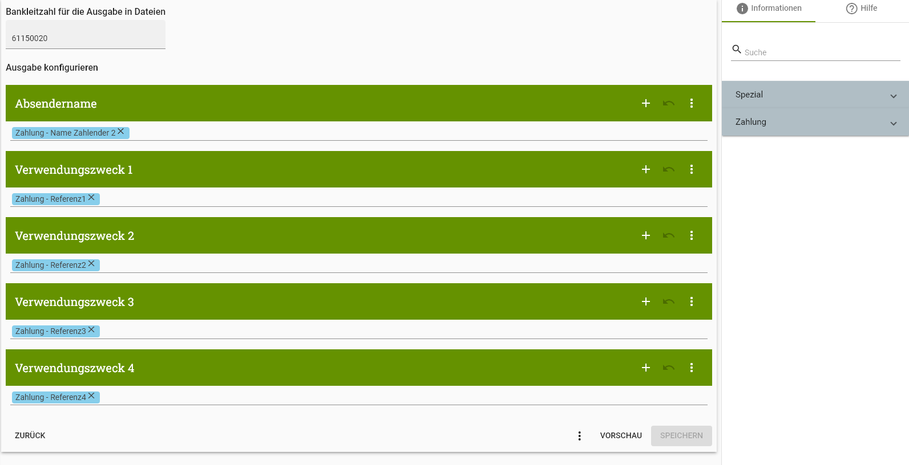

# Wise zu PayJoe

Dieses Tool kann [Wise.com](https://wise.com/)-CSV-Dateien in [PayJoe](https://www.payjoe.de/) importieren. PayJoe kann man an Software anbinden, die HBCI unterstützt.

Somit kann man zum Beispiel den Wise.com-Kontenabgleich in Lexoffice oder Lexware buchhaltung implementieren.

## Installation

Dieses Repository [als ZIP herunterladen](https://github.com/Sanjo-Solutions/wise-to-payjoe/archive/refs/heads/main.zip) und entpacken.

Zusätzlich [Node.js](https://nodejs.org/en) installieren.

Dann ein Terminal öffnen. Mit `cd <...>` in das Verzeichnis wechseln, in dem das Projekt entpackt wurde ("<...>" mit dem Pfad zum Verzeichnis ersetzen).
Dann die Abhängigkeiten mit `npm install` installieren.

Die Datei für die Umgebungsvariablen anlegen mit: `cp template.env .env`

Bei PayJoe einen Zugang mit Typ "API (Zahlungen)" anlegen. Die Zugangsdaten in die `.env`-Datei übertragen.

Beim PayJoe-Zugang ggf. die Ausgabe-Einstellungen anpassen. Ich habe es wie folgt bei mir eingestellt:

## Wie man das Tool verwendet

Bei Wise den gewünschten Bericht als CSV exportieren.
Die CSV-Datei in den Ordner dieser Software verschieben und die Datei zu `input.csv` umbenennen.

Im nächsten Schritt fällt für jede Transaktion, die sich in der CSV-Gebühr befinden, die PayJoe-Transaktions-Gebühr an.
Zum Importieren in PayJoe das Programm mit `npm run start` ausführen.

Wenn alles geklappt hat, sollten die Transaktionen in PayJoe erstellt worden sein.

## Import in ein HBCI-fähiges Tool

Anleitungen hierfür können Sie in der [PayJoe-Dokumentation](https://hilfe.payjoe.de/payjoe-hilfe/systeme-anbinden/) finden.
